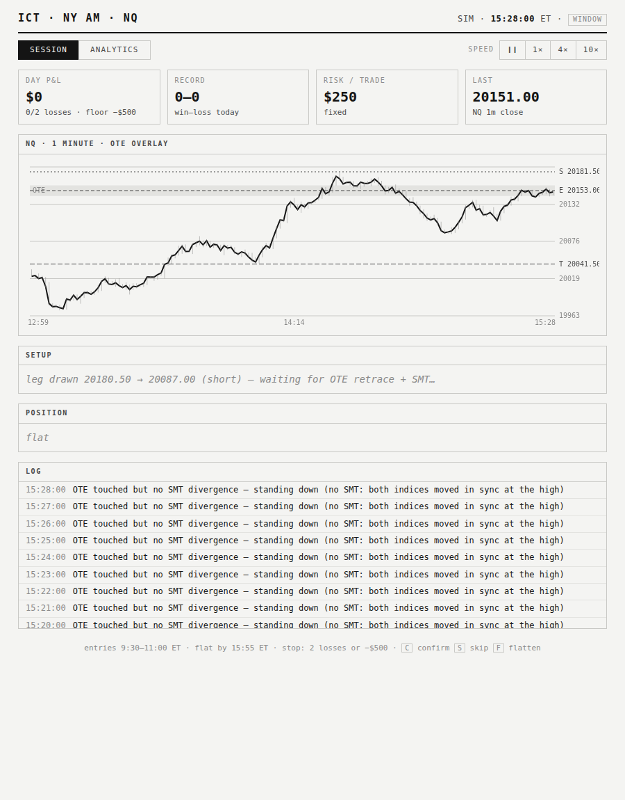
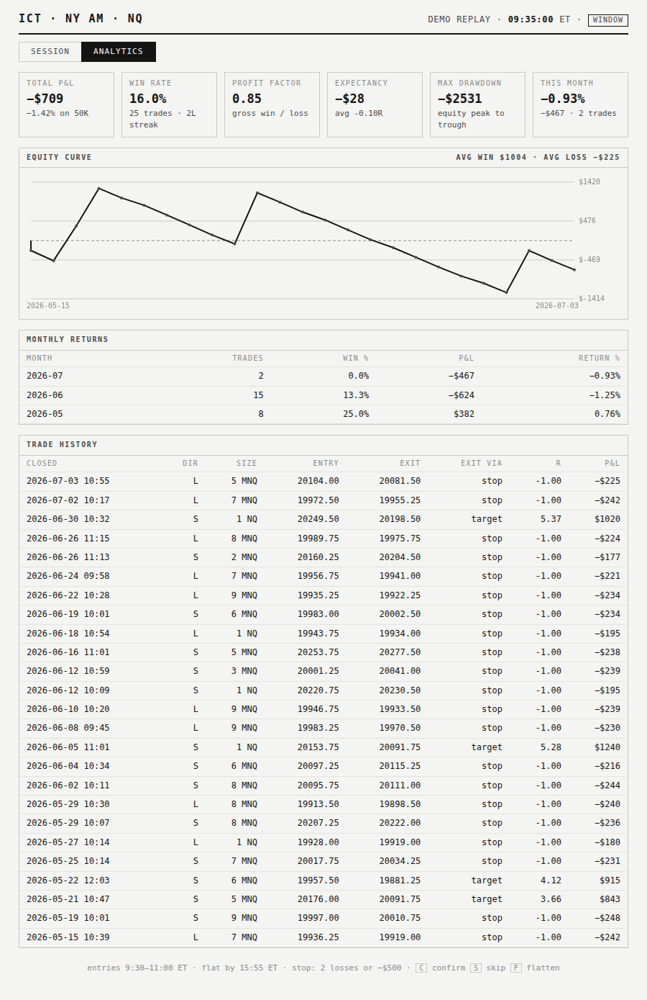

# ICT NY-AM Bot

A trading bot for NQ (Nasdaq futures) built on ICT concepts — liquidity sweeps,
OTE fibonacci entries, SMT divergence — tuned for the New York AM session and
Topstep funded-account rules. You stay in control: the bot finds the setup,
**you** click Confirm.



**No trading account or API key is needed to try it** — it ships with a built-in
practice market.

---

## Try it in 5 minutes (no account needed)

### Step 1 — Install Python

You need Python **3.10 or newer**.

- **Windows**: download from <https://www.python.org/downloads/> and run the
  installer. **Important:** tick the box that says *"Add python.exe to PATH"*
  on the first installer screen.
- **Mac**: download from the same page, or run `brew install python` if you
  use Homebrew.

To check it worked, open a terminal (see Step 3) and type `python --version`
(Windows) or `python3 --version` (Mac). You should see something like
`Python 3.12.x`.

### Step 2 — Download this project

Easiest way (no git needed):

1. Click this link: **<https://github.com/boofpackx/Trading/archive/refs/heads/main.zip>**
2. Unzip it somewhere easy to find, like your Desktop.
3. You'll get a folder called `Trading-main`.

Or, if you have git: `git clone https://github.com/boofpackx/Trading.git`

### Step 3 — Open a terminal in that folder

- **Windows**: open the `Trading-main` folder in File Explorer, click the
  address bar at the top, type `cmd`, and press Enter.
- **Mac**: open the Terminal app, type `cd ` (with a space), drag the
  `Trading-main` folder onto the Terminal window, and press Enter.

### Step 4 — Install the bot's dependencies

Copy-paste this and press Enter:

```
pip install -r requirements.txt
```

(If that says "pip is not recognized", use `py -m pip install -r requirements.txt`
on Windows, or `pip3 install -r requirements.txt` on Mac.)

### Step 5 — Start the bot

```
python -m bot
```

(Windows fallback: `py -m bot` · Mac fallback: `python3 -m bot`)

Leave that window open — it's the bot running.

### Step 6 — Open the dashboard

Open your web browser and go to:

**http://127.0.0.1:8000**

That's it. You're watching a simulated NQ session (one sim-minute per second
or so). Things to try:

- Use the **speed buttons** (1× / 4× / 10×) in the top right to fast-forward.
- Watch the **Log** panel — you'll see it find impulse legs, wait for OTE
  retraces, and reject setups that lack SMT divergence.
- When a setup card appears, click **Confirm** (or press **C**) to take the
  trade, **Skip** (or **S**) to pass.
- Click the **Analytics** tab for your stats, equity curve, and trade history.
- To stop the bot, go back to the terminal and press **Ctrl+C**.

Practice trades are saved to `journal.sim.jsonl`, so your analytics build up
across runs.

---

## Connect your Topstep account (live mode)

> ⚠️ Do this only after you're comfortable with sim mode. Futures are risky.
> Start on an eval/practice account, never with money you can't lose.

### Step 1 — Get your API key

1. Log in to TopstepX.
2. Go to **Settings → API Access** and generate an API key.
3. Copy your **username** and the **key** somewhere safe.

### Step 2 — Create your settings file

In the project folder, find the file called `.env.example`. Make a copy of it
named exactly `.env` (just `.env`, nothing before the dot), then open it in
any text editor and fill in:

```
PROJECTX_USERNAME=your_topstepx_username
PROJECTX_API_KEY=your_api_key_here
BOT_MODE=live
```

### Step 3 — Start the bot

```
python -m bot
```

The log will show `ProjectX account XXXXX connected`. If the login fails, the
bot automatically drops back to sim mode and says so in the log — your real
account is never touched by practice trades (they're journaled separately).

When you click Confirm in live mode, the bot places a real bracket order
(entry limit + stop-loss + take-profit) on your account.

---

## What the bot actually does

| Rule | Value |
|---|---|
| Session | entries 9:30–11:00 ET only; unfilled orders cancelled at 11:00 |
| Flat before close | everything force-closed by 15:55 ET |
| Structure / entry | 5-minute structure, 1-minute entries |
| Risk per trade | $250 fixed — sized in NQ minis, falls back to MNQ micros |
| Entry | limit at the 70.5% OTE sweet spot of the impulse leg |
| Take profit | 30–50 NQ points from entry (uses the internal high/low when it's inside that band) |
| Stop | 4 ticks beyond the sweep extreme |
| Minimum R:R | 1:1 |
| SMT filter | NQ-vs-ES divergence required at the raid |
| Daily guardrails | halts after 2 losses or −$500 (half the Topstep 50K daily limit) |
| Contract caps | 5 minis / 50 micros |
| Execution | bot stages the trade; **you** click Confirm |

The setup sequence it hunts for: sweep of an internal low/high → displacement
→ retracement into the 61.8–79% OTE band → SMT divergence between NQ and ES →
staged for your one-click confirm.

In live mode, a mid-session restart **restores today's stats from the
journal**, so the daily-loss guardrail can't be reset by rebooting the bot.



---

## Analytics

The **Analytics** tab computes from your full trade history:

- Total P&L and return % on the 50K account, **monthly return %** table
- Win rate, profit factor, expectancy per trade, average R-multiple
- Average win / average loss, streak, max drawdown
- Equity curve with per-trade hover, trade history table, CSV export

Sim and live trades are journaled to separate files (`journal.sim.jsonl` /
`journal.live.jsonl`) so practice never contaminates your real stats.

---

## Backtesting

```
# real NQ/ES 1-minute data via your TopstepX key (.env must be filled in)
python -m bot.backtest --start 2025-01-01 --end 2025-12-31

# no key needed: synthetic sessions (proves the machinery, NOT the strategy)
python -m bot.backtest --synthetic 252
```

Replays each historical NY AM session through the exact same engine and
guardrails, then prints monthly returns, win rate, profit factor, expectancy,
and max drawdown.

---

## Put the demo on the web (optional)

The `docs/` folder is a static demo that replays a recorded session — no
server needed. To publish it free on GitHub Pages:

1. Go to **Settings → Pages** on your GitHub repo.
2. Source: **Deploy from a branch** → branch **main**, folder **/docs** → Save.
3. A minute later it's live at `https://<your-username>.github.io/Trading/`.

Regenerate the recording anytime with `python tools/build_demo.py`.

---

## Changing the settings

Every knob lives in **`bot/config.py`** with comments: risk per trade, session
window, take-profit band (`fixed_target_min/max`), target mode
(`"fixed"` or `"internal"`), guardrails, OTE ratios, and more. Edit, save,
restart the bot.

---

## Troubleshooting

| Problem | Fix |
|---|---|
| `python` is not recognized | Reinstall Python with *"Add to PATH"* ticked, or use `py` instead of `python` (Windows) |
| `pip` is not recognized | Use `py -m pip ...` (Windows) or `pip3 ...` (Mac) |
| `address already in use` | The bot is already running in another window — close it, or start with another port: `PORT=8001 python -m bot` and open http://127.0.0.1:8001 |
| Page loads but nothing updates | Make sure you installed with `pip install -r requirements.txt` (it includes websocket support), then restart the bot and refresh the page |
| `ProjectX login failed` in the log | Check `.env` values; the bot keeps running in sim mode meanwhile |
| No setups appearing | Normal — the strategy is selective. Speed up the sim (10×) or restart for a fresh session. Entries only stage between 9:30–11:00 ET (sim clock) |

## Run the tests

```
python -m pytest tests/ -q
```

---

## Disclaimer

This is not financial advice, and past or simulated results do not guarantee
future performance. Futures trading carries substantial risk of loss.
Forward-test on a practice account before risking a funded account.
